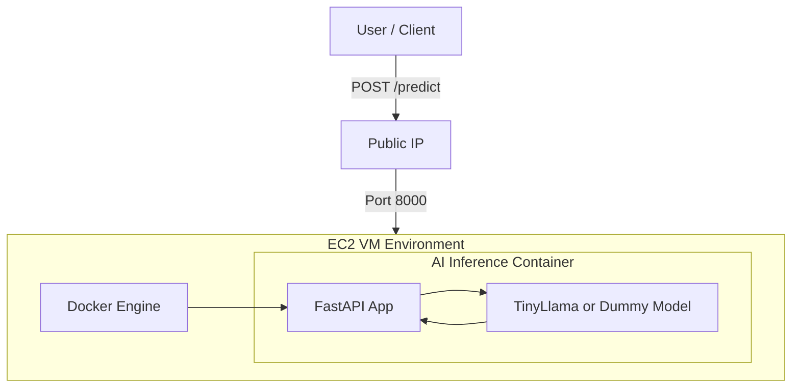

# Terraform-Provisioned AI Inference Server


> **Level 2 - Intermediate (The Cloud Automator)**

**Status**: Production Ready | **IaC**: Terraform 100% | **Cost**: ~$0.53/hr

## Concept
A Senior Cloud Architect doesn't "click ops". This project demonstrates a fully automated **Infrastructure as Code (IaC)** pipeline to provision a GPU-enabled AI Inference Server from scratch.

By running a single command `terraform apply`, we spin up:
1.  **Network**: Security Groups & Public IP.
2.  **Compute**: AWS EC2 `g4dn.xlarge` (T4 GPU) or equivalent.
3.  **Bootstrap**: Ansible playbook execution via `user-data` to install Docker, Nvidia Drivers, and deploy the AI Container.
4.  **Service**: A FastAPI-based AI Inference model exposed to the internet.

---

##  Architecture

The traffic flows from the user directly to the GPU instance serving the model inside a Docker container.



*See `architecture/diagram.mermaid` for editable source.*

---

## Tech Stack
| Component | Technology | Role |
|-----------|------------|------|
| **Provisioning** | **Terraform** | VPC, EC2, Security Groups, Key Pairs |
| **Config Mgmt** | **Ansible** / Shell | Docker install, App deployment |
| **Compute** | **AWS EC2 (GPU)** | `g4dn.xlarge` (Nvidia T4) |
| **Container** | **Docker** | Isolation, Environment reproducibility |
| **Application** | **FastAPI** | High-performance async API |

---

## Quick Start

### Prerequisites
- [Terraform](https://developer.hashicorp.com/terraform/install) installed.
- AWS CLI configured (`aws configure`).
- SSH Client.

### Deployment (The "One Command" Flow)
1.  **Initialize Terraform**:
    ```bash
    cd terraform
    terraform init
    ```

2.  **Provision & Deploy**:
    ```bash
    terraform apply -auto-approve
    ```
    *Wait approx 3-5 minutes for instance creation and Ansible bootstrapping.*

3.  **Access**:
    Terraform will output the `api_endpoint` and `ssh_command`.
    ```bash
    # Example Output
    api_endpoint = "http://54.123.45.67:8000/predict"
    ```

4.  **Test Inference**:
    ```bash
    curl -X POST "http://<YOUR_IP>:8000/predict" \
         -H "Content-Type: application/json" \
         -d '{"input_data": "test_image_base64"}'
    ```

---

## Cost Analysis (Critical)

**Region**: `us-east-1` (N. Virginia)
**Instance**: `g4dn.xlarge` (4 vCPUs, 16 GiB RAM, 1x NVIDIA T4 GPU)

| Resource | Rate (Approx) | Monthly (730 hrs) |
|----------|---------------|-------------------|
| **EC2 Linux** | $0.526 / hr | $383.98 |
| **EBS Storage (50GB)** | $0.08 / GB | $4.00 |
| **Data Transfer** | $0.09 / GB | Variable |
| **TOTAL** | **~$0.53 / hr** | **~$390 / month** |

> [!WARNING]
> **Billing Risk**: This architecture uses expensive GPU resources.
> **ALWAYS** run the destruction script immediately after testing.

---

## Cleanup (Destroy)

To prevent billing shock, use the provided cleanup script:

```bash
cd ../scripts
bash destroy.sh
```
*This wraps `terraform destroy` to ensure all resources (Instance, disk, SG) are wiped.*

---

## Value Proposition
This project proves:
- **Full Automation**: No manual SSH required to set up the server.
- **Reproducibility**: `terraform apply` works the same way every time.
- **Production Mindset**: Security groups are explicit, secrets (keys) are managed (locally), and state is tracked.
- **DevOps competency**: Integrating Terraform (Infra) + Ansible (Config) + Docker (App).


